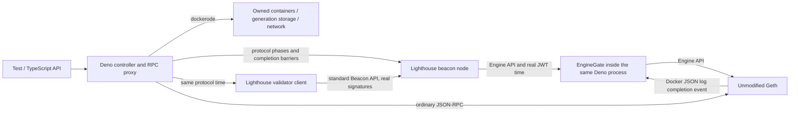

# Architecture and verification boundaries

For a first pass through the implementation, read
[How protocol time and warp work](warp-algorithm.md). It follows one request through the honest/fast
algorithms and links each step to its source.

Hardfork recipes live in `bakes/pectra/recipe.json` and `bakes/gloas/recipe.json`. Pectra targets
Prague/Electra with unmodified Geth v1.15.11 and Lighthouse v7.1.0. Gloas targets the pinned
experimental Amsterdam/Gloas implementations. A bake records the actual source commits, clock patch
hashes, toolchains, immutable image IDs and platform in `bakes/<hardfork>/tags/<tag>.json`.
`src/baker.ts` builds or imports artifacts; runtime startup reads the selected bake without
compiling. See [bake commands and provenance](bakes.md). Deno 2.9.7 passed the dockerode 4.0.7
socket/logs/exec/events lifecycle smoke test. Earlier attempted Deno 2.2.12 and 2.5.6 exposed Unix
HTTP stream failures, so they are not supported.

The baseline uses the official Lighthouse image. The controlled profile refuses to start without the
locally built fork. It never falls back to ordinary clocks.

Genesis, EL, BN, VC and the deposit-key fixture run with the controller's numeric UID/GID. Each
generation has separate bind-mounted EL, BN and shared/VC directories under `.panda/<id>` (or
`PANDA_DATA_DIR`). A non-root Linux controller can read and preserve this state. Fast VC replacement
keeps that user and opens the existing signing database.

Managed EL/CL/VC frontends share a maintenance gate outside the Timeline lock. A durable EL
admission ledger retains unresolved submissions independently of the txpool. Checkpoint-capable
bakes drain native writers, persist and read back a Lighthouse receipt, then stop VC→BN→EL before
recording file inventories. Resume starts parked and verifies exact data/time/heads before opening
ingress. See [lifecycle](lifecycle.md) for API, storage and failure semantics.

The controller serializes time mutations. Pectra slots have phase boundaries at 0, 4, 6, 8, 9 and
11.5 seconds: proposal, attestations/sync messages, selection-proof preparation, aggregates, state
advance and fork-choice preparation. Gloas uses 0, 3, 6, 9 and 11.5 seconds, with payload
attestation committee (PTC) work at 9 seconds. Advancing the BN first prevents the VC from proposing
into a future slot of the BN. A control clock acknowledgement only establishes the clock value;
completion watermarks and EL/CL head agreement establish completion of the protocol work.

Bakes declaring `directSync` deliver full sync contributions from the existing pool of verified
individual messages into the ordinary block operation pool. The VC still signs each validator's
message; controlled mode omits sync aggregator selection proofs and gossip wrappers. Completion is
bound to the exact slot and root and requires all 512 committee positions. The controller also
requires that root to match its execution-confirmed head. Candidate-pool admission may precede a
Gloas envelope; it is never treated as proof of execution validity. Missing keys cause a bounded
failure rather than successful advancement with missing votes. Ordinary mode keeps upstream
delivery.

`ManualSlotClock` only supplies time calculations and does not drive async tasks.
`BeaconChainHarness` explicitly drives block/attestation processing in tests, including optional
mocked execution. It is a useful reference, but is not used as the runtime client. The fork keeps
production clients and HTTP validation paths.

`bakes/shared/controlled_clock.rs` adds an opt-in process-local watch clock. Tokio watch
notifications wake protocol sleeps without polling while paused. Only the reviewed schedulers import
the new sleep functions. Ordinary Tokio timers, network request deadlines, JWT generation,
networking and watchdogs keep real time.

The protocol-clock part of the maintained patch changes:

- `common/slot_clock`: clock source and watch-based protocol sleeps.
- `beacon_node/timer`: per-slot work.
- `beacon_chain/{state_advance_timer,proposer_prep_service}`: state/fork-choice preparation.
- `validator_services/{duties,preparation,attestation,sync_committee}_service`: duty schedules and
  successful-work watermarks.
- `validator_client/src/lib.rs`: genesis wait and startup watermark.
- `beacon_node_fallback`: slot-based status schedule; request deadlines remain real.

The Gloas patch additionally covers payload attestations, proposer/builder preferences and the
attestation deadline raced against a head event. That last deadline must use protocol time: a large
skipped-slot state transition can otherwise let the real timer fire before duties finish loading.

The selected `direct-sync` bake also retains controlled BLS verification reuse/batching and direct
sync contribution delivery; Gloas includes prepared empty-slot state caching. These are native
changes beyond a clock replacement. Their roles and limits are described in the
[algorithm walkthrough](warp-algorithm.md). Choosing honest versus fast adds no further client
patch.

Network gossip subscriptions, real-time metrics/notifiers, and optional services are not converted
globally. P2P is disabled in this single-node topology. Extending to multi-node/fork-transition
testing needs a separate scheduler audit. Current barriers assume that all genesis validators are
held by the single VC.

Geth's PoS header verification deliberately does not compare a block timestamp with the host clock;
it still requires a strictly increasing timestamp. Engine API payload attributes supply that
timestamp. Payload-building deadlines and txpool expiry continue to use real time. Source evidence:
[Beacon header validation](https://github.com/ethereum/go-ethereum/blob/v1.15.11/consensus/beacon/consensus.go),
[Engine API](https://github.com/ethereum/go-ethereum/blob/v1.15.11/eth/catalyst/api.go),
[payload preparation](https://github.com/ethereum/go-ethereum/blob/v1.15.11/miner/worker.go).
Runtime acceptance beyond host time, finality and lifecycle are exercised by the real e2e scripts.

`src/engine.ts` is a version-specific Engine API adapter inside the same controller process. Geth
v1.15.11 starts payload jobs with an empty payload, builds the full payload asynchronously, and uses
a real 12-second building deadline. `getPayloadV4` can return the empty version immediately. The
adapter forwards fork-choice updates but removes payload attributes for a future protocol slot, so a
pause cannot consume its build window. For the current slot, it waits for the Geth JSON
`Updated payload` event before forwarding `getPayload`. That log follows installation of the full
payload under its lock. It does not alter a payload, signatures, withdrawals, requests or finality.
Source:
[payload builder](https://github.com/ethereum/go-ethereum/blob/v1.15.11/miner/payload_building.go).
The log stream uses dockerode; waits are bounded and readiness IDs are capped at 128. This
dependency must be rechecked before changing the Geth version.

Startup checks the selected recipe's Engine capabilities using a real-time JWT. Pectra reads the
execution payload inside the Beacon block. Gloas reads its separate execution payload envelope and
checks the bid hash and slot against it. A finalized Gloas Beacon checkpoint commits its execution
parent; the checkpoint's own envelope is not yet the finalized execution payload.

Docker containers reach this adapter through `host.docker.internal`; it therefore listens on a host
wildcard address. It verifies the shared JWT signature and **real-time** issue time before
processing any call, and Geth verifies the JWT again. Public RPC, Beacon API and clock/VC ports are
bound to localhost. The JWT-protected Engine listener is the sole wildcard-listener exception.

Automine forwards the upstream RPC response unchanged and schedules bounded work. It checks the next
sender nonce, balance, next block base fee and gas limit; nonce gaps alone never advance time. A
candidate set that survives a produced block unchanged stops the loop. Manual advancement can
re-evaluate pending work. Direct calls to the private EL endpoint bypass automine; tests should use
the controller's advertised RPC endpoint.

For an upstream update: pin new commits and images, inspect every patch hunk and protocol sleep call
site, regenerate the appropriate maintained patch against a clean pinned checkout
(`bakes/pectra/patch.py` or `bakes/gloas/patch.py`), run the Rust clock test and `test:profile` for
that hardfork/tag. The profile suite includes ordinary baseline and all real e2e checks. Preserve
original signature/state checks. Build cost is independent of ordinary devnet startup.

`advanceSlots`/`advanceEpochs` and default `advanceTime`/`advanceTo` share the phase executor for
every intervening proposal, vote and state transition. Per-call `{ mode: "fast" }` restores the
previous skip path for gaps over 32 slots, followed by the destination's real block. Honest mode
remains the default; both modes share the same serialized timeline and fault until reset after
ambiguous partial progress. Mode selection adds no EL/CL patch. `skipSlots` finishes the current
slot, stops the VC, advances BN time and restarts the VC with the same keys and slashing protection
at the new time. Real empty-slot transitions, penalties and committee changes are preserved. Gloas
bakes with `preparedSkip` run these transitions once before restarting the VC and persist every
intermediate state summary and configured HDiff base through the ordinary store methods required by
import and finalization. Replay-only summaries use bounded write batches; only useful
epoch/destination states are cloned into RAM. Controlled prepared bakes use a 512-slot first diff
layer to reduce disk work for the small registry. Duties, withdrawal calculation and block
verification reuse compatible states for the same head root. Older bakes perform catchup during
block processing. Private VC port numbers may change; the manifest is updated. No fake votes fill
the gap.

The default mainnet churn quotient is 65536 for Pectra and 32768 for Gloas. With 64 validators,
Electra has no consolidation churn capacity: its activation/exit allocation consumes the available
churn. `bakes/shared/tests/protocol_test.ts` explicitly sets `churnLimitQuotient: 4` (512 ETH total
balance churn, 256 ETH consolidation capacity before balance changes) to test consolidation without
thousands of keys. All ordinary timing delays, including 256-epoch exit eligibility and withdrawal
delay, remain intact. See
[Electra churn rules](https://github.com/ethereum/consensus-specs/blob/v1.5.0/specs/electra/beacon-chain.md).

Gloas separates consolidation churn from activation/exit churn. Its default
`consolidationChurnLimitQuotient` is 65536, independently of the default balance churn quotient
32768. The consolidation fixture explicitly sets both to 4 and checks the generated Beacon spec.
Changing the ordinary churn quotient alone would leave this small Gloas network without capacity.

The exit fixture observes a real EL withdrawal. A validator may still belong to the current sync
committee after exit and receive small subsequent rewards. In pinned Lighthouse, the API status
`withdrawal_done` uses effective balance, updated at an epoch transition. The fixture additionally
waits through the committee rotation and final sweep, checking zero actual balance and final status.
